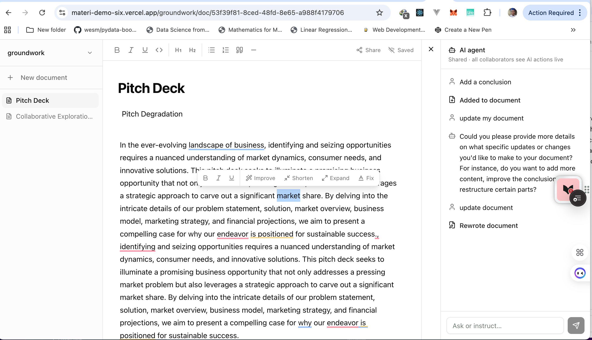
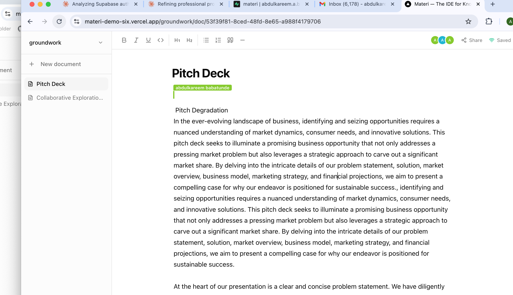
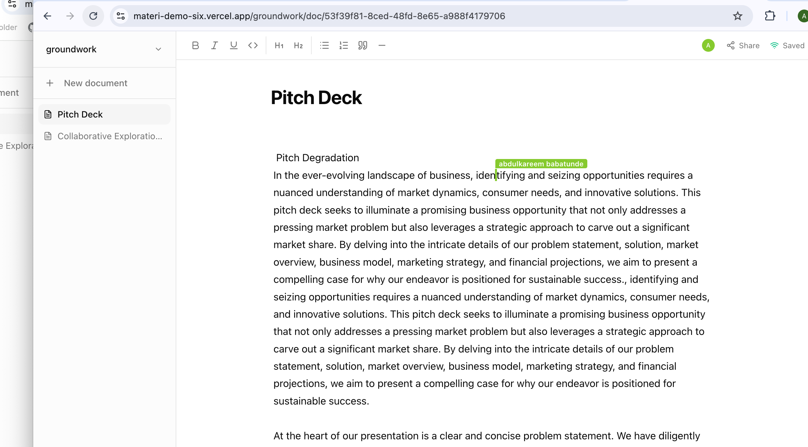
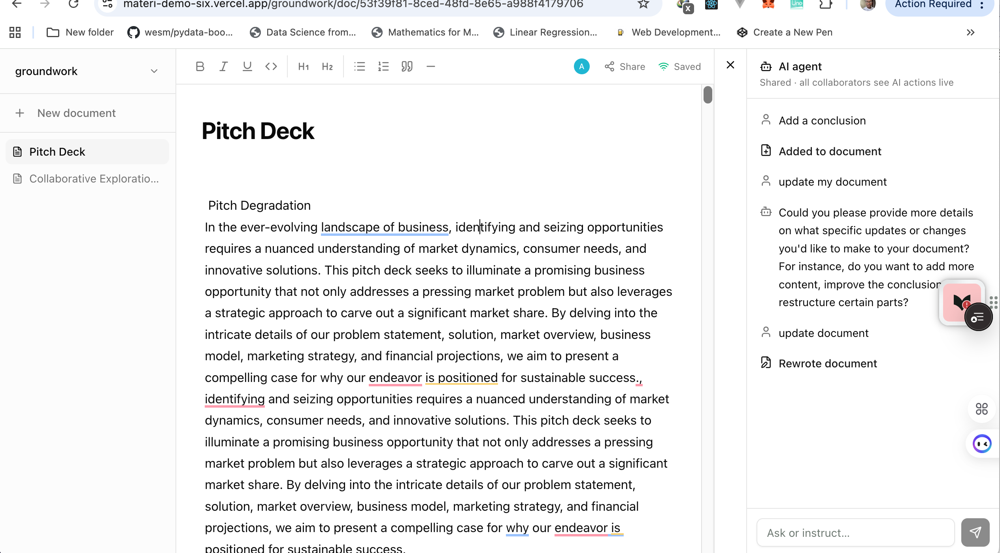
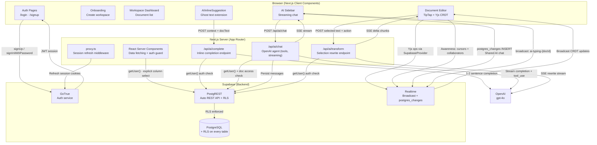
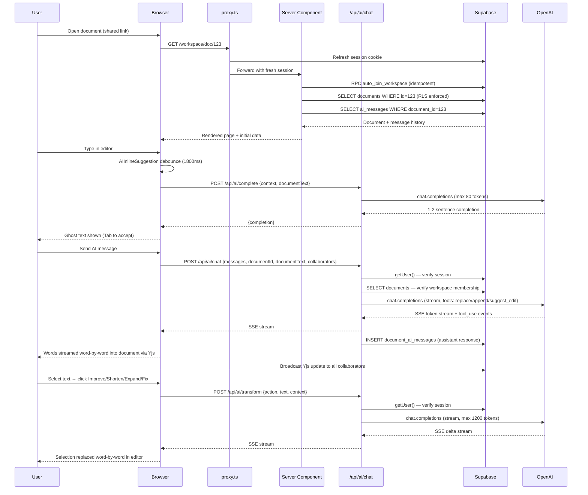
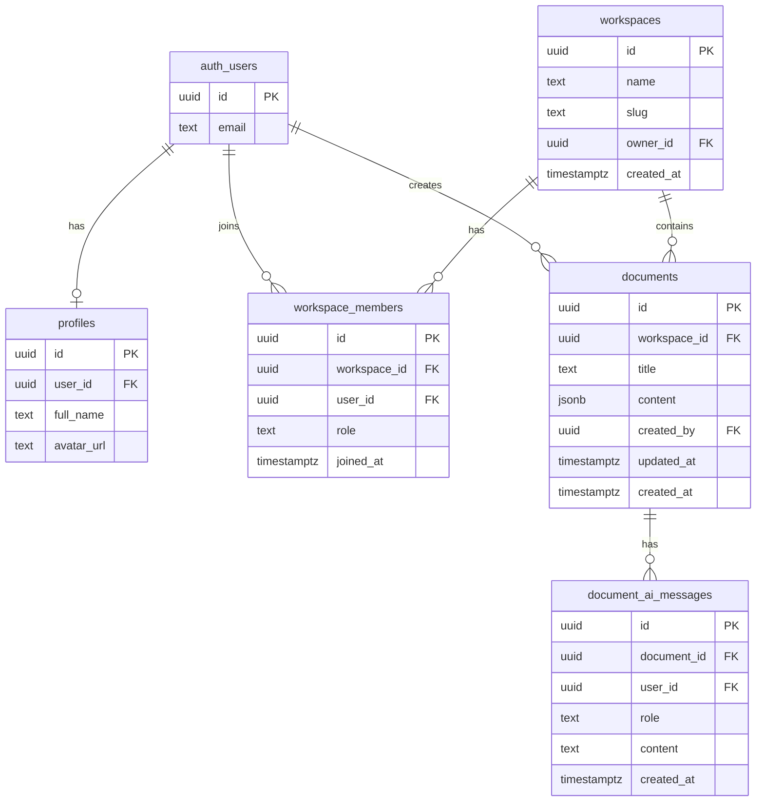

# Materi

A real-time collaborative document platform with an AI agent that edits alongside you.

Built with Next.js 16, Supabase, TipTap v2, Yjs CRDT, and OpenAI gpt-4o.

---

## Screenshots

### AI Agent Sidebar

The shared AI chat lets collaborators instruct the agent to write, rewrite, expand, or edit — all visible live.





### Real-time Collaborative Editing

Multiple users edit simultaneously with live cursors, name labels, and conflict-free merging via Yjs CRDT.





---

## Features

| Feature | Detail |
|---------|--------|
| **Real-time collaboration** | Multiple users edit the same document simultaneously via Yjs CRDT over Supabase Realtime |
| **AI inline suggestions** | Ghost text completions as you type — Tab ↵ to accept, Escape to dismiss, 1800ms debounce |
| **AI word-by-word streaming** | AI edits stream word-by-word into the shared document, visible to all collaborators live |
| **Floating AI bubble menu** | Select any text → Improve / Shorten / Expand / Fix — AI rewrites the selection in place |
| **Shared AI chat** | All collaborators see the AI's actions live; chat persisted per-document with markdown rendering |
| **Context-aware agent** | AI knows who is editing, who the other collaborators are, and the full document content |
| **AI tools** | Agent can rewrite the document, append content, or apply surgical edits via `suggest_edit` |
| **AI editing indicator** | Toolbar shows a live "AI editing…" pulse whenever the agent is streaming into the document |
| **⌘J keyboard shortcut** | Toggle the AI panel from anywhere in the editor |
| **Live word count** | Word count and estimated reading time update as you type |
| **Share link auto-join** | Any authenticated user with the link is automatically added to the workspace |
| **Multi-tenant workspaces** | Full workspace/member model from day one — all data isolated by membership |
| **Row-Level Security** | Every table has RLS. `auth.uid()` enforced on every policy. No `select=*` anywhere |
| **SECURITY DEFINER RPCs** | Atomic mutations (`create_workspace`, `create_document`, `auto_join_workspace`) run with reliable auth context |
| **Mobile responsive** | Full responsive layout — sidebar drawer on mobile, bottom-sheet AI panel, scrollable toolbar |
| **Dark mode** | System-aware dark/light theme via Tailwind CSS v4 |

---

## Architecture



### Request lifecycle



### Database schema



---

## Security model

| Layer | Implementation |
|-------|---------------|
| Auth | Supabase GoTrue — JWT sessions, anti-enumeration errors |
| Row-Level Security | Every table has RLS enabled. `auth.uid()` enforced on every policy |
| API routes | Server-side `getUser()` before any OpenAI or DB operation |
| Column exposure | Explicit column selection everywhere — zero `select=*` |
| Workspace isolation | All queries scoped through `workspace_members` membership |
| Mutations | `SECURITY DEFINER` RPCs for atomic operations with reliable auth context |
| Share links | `auto_join_workspace` is idempotent — safe to call on every page load |

---

## How real-time AI editing works

```
User sends AI message
  → /api/ai/chat streams SSE events
  → On tool_call (replace_document / append_to_document):
      → Content streamed word-by-word via view.dispatch(tr.insertText(word, endPos))
      → Each insert goes through TipTap's Collaboration extension → Yjs CRDT
      → Supabase Realtime broadcasts the Yjs op to all connected clients
      → All collaborators see words appearing live in the document
      → User's cursor position is unaffected (inserts happen at document end)
```

Bubble menu rewrites run on selections:
```
Select text → click action (Improve / Shorten / Expand / Fix)
  → POST /api/ai/transform {action, text, context}
  → Selection deleted from editor
  → AI response streamed back word-by-word at same position via ProseMirror transactions
  → Goes through Yjs CRDT → visible to all collaborators live
```

Inline suggestions run independently:
```
User types → 1800ms debounce → POST /api/ai/complete → ghost text rendered
Tab         → insertText at cursor position (suggestion accepted)
Escape      → suggestion dismissed
Any key     → suggestion dismissed, normal typing continues
```

---

## Stack

| Layer | Technology |
|-------|-----------|
| Framework | Next.js 16 App Router + TypeScript |
| Auth + DB | Supabase (GoTrue + PostgreSQL + PostgREST + Realtime) |
| UI | Tailwind CSS v4 + shadcn/ui |
| Editor | TipTap v2 (ProseMirror) |
| CRDT | Yjs + custom SupabaseProvider (no WebSocket server needed) |
| AI agent | OpenAI gpt-4o — streaming SSE, tool_use, inline completions |
| Deployment | Vercel (zero-config Next.js) |

---

## Setup

### 1. Install

```bash
npm install
```

### 2. Supabase project

Create a project at [supabase.com](https://supabase.com), then run the migrations in order via the SQL Editor:

```
supabase/migrations/001_initial.sql          — schema, RLS policies, indexes, SECURITY DEFINER RPCs
supabase/migrations/002_realtime.sql         — enable Realtime on document_ai_messages
supabase/migrations/003_auto_join.sql        — auto_join_workspace RPC for share links
supabase/migrations/004_profiles_coworkers.sql — co-member profile visibility for collaborator names
```

In **Authentication → Providers → Email**, disable **"Confirm email"** for demo use.

### 3. Environment

Create `.env.local`:

```env
NEXT_PUBLIC_SUPABASE_URL=https://project.supabase.co
NEXT_PUBLIC_SUPABASE_ANON_KEY=anon-key
OPENAI_API_KEY=sk-...
OPENAI_MODEL_CHAT=gpt-4o
NEXT_PUBLIC_APP_URL=http://localhost:3000
```

### 4. Run

```bash
npm run dev
```

---

## Deploy to Vercel

1. Push to GitHub
2. Import repository at [vercel.com](https://vercel.com/new)
3. Add environment variables matching `.env.local` — update `NEXT_PUBLIC_APP_URL` to your production domain
4. Deploy — Vercel auto-detects Next.js, no additional build config needed

For Supabase Auth redirects in production:
- In Supabase → **Authentication → URL Configuration**, add your Vercel URL to **Redirect URLs**
- Optionally configure [Resend](https://resend.com) as your SMTP provider to avoid shared-infra deliverability issues

---

## Key design decisions

**SupabaseProvider instead of y-websocket** — Running a WebSocket server is an extra infrastructure dependency. `SupabaseProvider` implements the Yjs awareness and update protocol over Supabase Realtime broadcast channels. No separate server, no cold-start latency, same CRDT guarantees.

**SECURITY DEFINER RPCs for mutations** — PostgREST RLS policies run as the calling user. For operations that require creating multiple records atomically (e.g., creating a workspace also inserts into `workspace_members`), a `SECURITY DEFINER` function provides a reliable, auditable auth boundary without client-side race conditions.

**Per-document AI message persistence** — Session-scoped AI context disappears when the tab closes. Per-document persistence means context survives refreshes, is shared with collaborators, and enables the Realtime shared-chat feature where all users see the AI conversation live.

**Word-by-word AI streaming via ProseMirror transactions** — Instead of setting the full document content at once, each word is inserted via `view.dispatch(tr.insertText(word, endPos))`. This goes through the Yjs Collaboration extension, propagating each word as a separate CRDT operation to all connected peers in real time.
