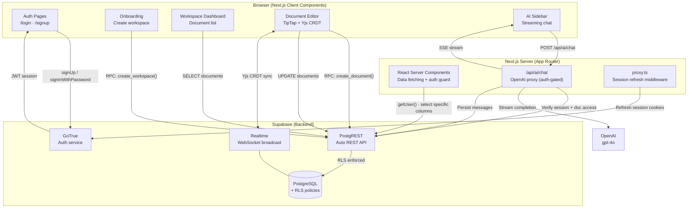
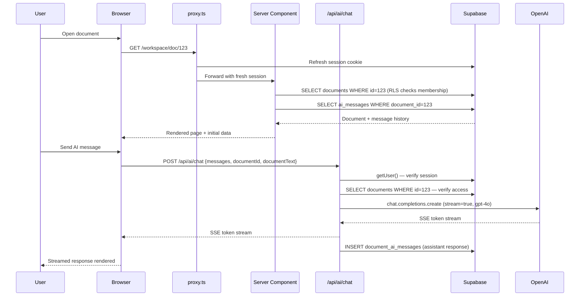
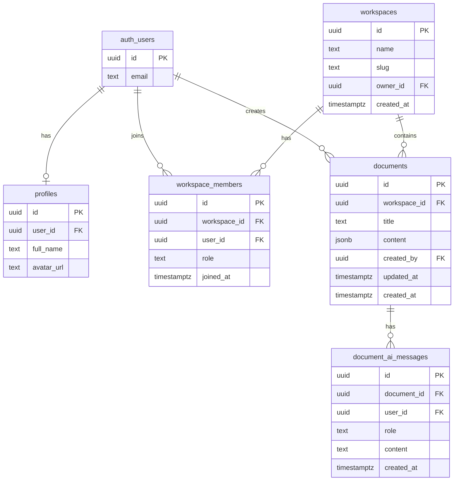

# Materi

A production-ready knowledge work platform — real-time collaborative documents with a document-scoped AI assistant that remembers context across sessions.

Built with Next.js 16, Supabase, TipTap, Yjs, and OpenAI gpt-4o.

---

## Architecture



### Request lifecycle



### Database schema



---

## Security model

| Layer | Implementation |
|-------|---------------|
| Auth | Supabase GoTrue — JWT sessions, anti-enumeration errors |
| Row-Level Security | Every table has RLS. `auth.uid()` enforced on all policies |
| API routes | Server-side `getUser()` before any OpenAI or DB call |
| Column exposure | Explicit column selection everywhere — no `select=*` |
| Workspace isolation | All queries scoped to `workspace_members` membership |
| Mutations | `SECURITY DEFINER` RPCs for atomic operations with reliable auth context |

---

## Stack

| Layer | Technology |
|-------|-----------|
| Framework | Next.js 16 App Router + TypeScript |
| Auth + DB | Supabase (GoTrue + PostgreSQL + PostgREST + Realtime) |
| UI | Tailwind CSS + shadcn/ui |
| Editor | TipTap v2 |
| CRDT | Yjs (real-time collaboration foundation) |
| AI | OpenAI gpt-4o via streaming SSE |
| Email | Resend (custom SMTP, replaces Supabase shared infra) |
| Deploy | Vercel |

---

## Setup

### 1. Install

```bash
npm install
```

### 2. Supabase project

Create a project at [supabase.com](https://supabase.com), then run the full migration in the SQL Editor:

```
supabase/migrations/001_initial.sql
```

In **Authentication → Providers → Email**, disable **"Confirm email"** for demo use.

### 3. Environment

Update `.env.local`:

```env
NEXT_PUBLIC_SUPABASE_URL=https://supabase.co
NEXT_PUBLIC_SUPABASE_ANON_KEY=anon-key
OPENAI_API_KEY=openai-key
OPENAI_ORG_ID=org-id
OPENAI_MODEL_CHAT=gpt-4o
NEXT_PUBLIC_APP_URL=http://localhost:3000
```

### 4. Run

```bash
npm run dev
```

---

## Deploy

Push to GitHub, import into [Vercel](https://vercel.com), set the environment variables. Update `NEXT_PUBLIC_APP_URL` to your production URL.
